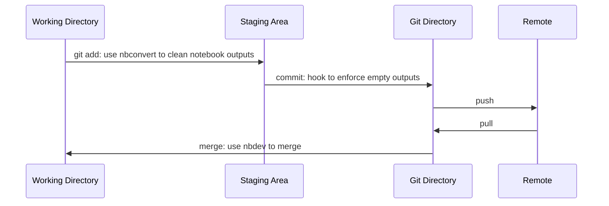

# Pre-commit hook to enforce empty notebook outputs and metadata.
## Using jupyter notebook pre-commit hook
### Motivation:
- Git projects ideally should not contain notebook outputs.
- Merge conflicts of notebooks often break the notebook s.t. they can no longer be opened. (Details see https://nbdev.fast.ai/api/merge.html#nbdev_merge.)

The `ipynb-output-strip` pre-commit hook enforces empty notebook cells and metadata on commits.

To solve these problems and make the commits pass the hook, set up your local git repo to ...
1. automatically clean notebooks when *staging* a notebook (git add ...), while still keeping the outputs in the working directory. This is done using the nbconvert package and setting up a [git clean filter](https://git-scm.com/book/en/v2/Customizing-Git-Git-Attributes).  However, outputs are still deleted when changes are pulled in.
2. use a different git merge strategy to not break notebooks. For details see https://nbdev.fast.ai/api/merge.html#nbdev_merge.


### Step-by-step guide
1. Install (e.g. pip install) the following packages in your virtual environment (and in your global python when using vscode GUI):
    ```
    pre-commit
    nbconvert
    gitpython
    nbdev
    ```
2. Add to your `pre-commit-config.yaml` file:
    ```
    - repo: https://github.com/saemeon/ipynb_output_strip_pre_commit
      rev: bedbd7195fd63d3f6e95c91f420245ca85b2adc5
      hooks:
        - id: check-ipynb-output-strip
    ```
    and run `$ pre-commit install`.
3. Add a `.gitattributes` file in the root of your repo with the following content: 
    ```
    *.ipynb filter=ipynb-output-strip
    *.ipynb merge=nbdev-merge
    ```
4. Add a `.gitconfig` file in the root of your repo with the following content: 
    ```
    [filter "ipynb-output-strip"]
        clean = "jupyter nbconvert --ClearOutputPreprocessor.enabled=True --ClearMetadataPreprocessor.enabled=True --to=notebook --stdin --stdout --log-level=ERROR"
    [merge "nbdev-merge"]
        description = resolve conflicts with nbdev_fix
        driver = "nbdev_merge %O %A %B %P"
    ```
5. Run the following command in the git repository root to add the .gitconfig file to the local git configuration options:
    ```
    $ git config --local include.path ../.gitconfig
    ```
    This command adds the following entry to your $GIT_DIR/config file, thus forcing it to include configuration options defined in the .gitconfig file:
    ```
    [include]
        path = ../.gitconfig
    ```
The resulting git flow:

